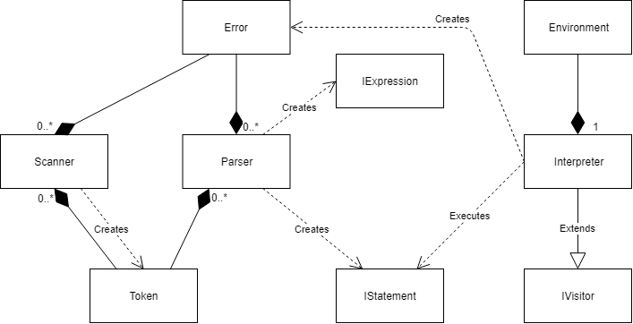
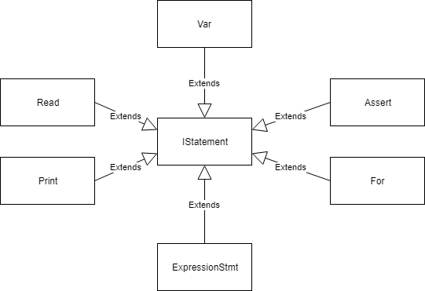
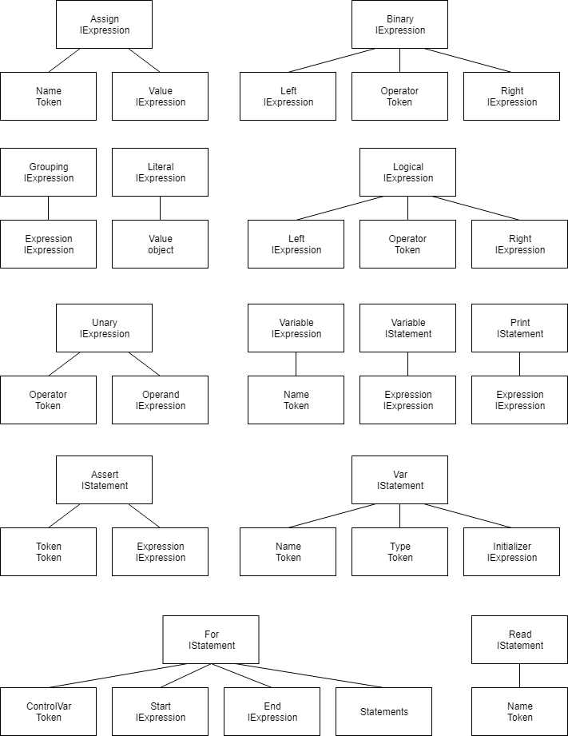

# Compilers Course Project - MiniPL Interpreter

This is a small interpreter project made for the [Compilers course](https://courses.helsinki.fi/fi/csm14204/) of the University of Helsinki. The project is based on the instructions Mini_pl_syntax_2018.pdf and Compilers_project_2018.pdf that are beside this document.

- Student: Jacinto Ramirez Lahti
- Project Name: MiniPLInterpreter
- Date of submission: 01.04.2018

The sourc code is in the MiniPlInterpreter folder of this repository and the documentation is this README.md that can also be foun in pdf format in the docs folder.

## How to run it
The interpreter was developed using .NET Core 2.0.0 on Windows 10.

Compilation can be done with the dotnet command line tool using the following commands in the project folder where the MiniPlInterpreter.csproj file is located:

```
dotnet restore
dotnet build
```

Run the compiled program:
- With no arguments: You'll be able to run programs by writing them into the console in one line.´
```
dotnet run
```
- With script file path: Run the script file
```
dotnet run "C:\scriptfile"
```

## Architecture
The following class diagrams show the architecture of the interpreter:




Here is a brief explanation of the different classes and interfaces:
- **Scanner:** In charge of scanning the source code and form *Tokens* from it. It generates *Errors* whenever a lexical error is found.
- **Parser:** In charge of transforming the *Tokens* it gets as input into *IStatements* that might contain *IExpressions*. It generates *Errors* whenever a syntactical error is found.
- **Interpreter:** Executes the *IStatements* it receives as input. Implements the *IVisitor* interface to handle the AST. It also has an *Environment* object. It creates semantic/runtime "Errors" after which it stops.
- **Error:** Helper class that keeps the error info of all the phases of the interpreter and is able to format them into a readable string.
- **Token:** Class that contains the tokenized information of the source code. The basic info it contains is: token type (enum), lexeme, literal (when applicable) and line number. The line number is used by the *Error* class to give more meaningful errors.
- **IVisitor:** Interface used to help with the traversal of the AST tree.
- **IExpresion:** Interface that is implemented by all the classes that represent the expresions available in the langugae: *Assign*, *Binary*, *Grouping*, *Literal*, *Logical*, *Unary* and *Variable*. All expressions implement the Accept method used in the Visitor pattern.
- **IStatement:** Interface that is implemented by all the classes that represent the statements available in the langugae: *Assert*, *ExpressionStmt*, *For*, *Print*, *Read* and *Var*. All statements implement the Accept method used in the Visitor pattern.

The Program class containing the entry point of the project runs the *Scanner*, *Parser* and *Interpreter* sequencially. This implementation makes the different parts independant from each other and thus easier to replace.

Due to the small size of the language and the programs run with it I saw no need to create a separate semantic analyser. The *Interpreter* class deals with the semantic errors at runtime. An analyser would be very easily implementable by impleneting the *IVisitor* interface and moving the error handling from the *Interpreter* to this new class.

## Testing
A testing project for the *Scanner* tests it thorougly. All the tokens and errors are tested and the three example programs are also used as more complex tests.

The *Parser* and interpreter by hand on every step of development as they were developed in tandem. In consequence for the interpreter to work as inteded the *Parser* has to work too.

## Token patterns
Most of the tokens are single character lexemes that don't really need a complex regex to represent them and where just simply matched, those were: '+', '-', '*', '/', '<', '&', '!', ':', ';', '(', ')', '=', ":=", ".."
- The name of identifiers was limited to a sequences of letters, underscores and digits, starting with a letter: ((\a)(\a|_|\d))*
- Strings: "([^"\n]|\\[^\n])*"
- Integers: (\d)+
- Normal comments: //[^\n]*
- Multi-line comments are a bit more complex: /\*.*[\n]*.*\*\/

## Modified syntax definition to be LL(1) compliant
There were just a couple of things that need to be changed from the original syntax definition given in the instructions to make it LL(1) compliant and for clarity:
- Modyfying \<stmts> so that the optional part is its own production rule than can be empty.
- Modyfying the var statement so that the the optional part is its own production and can be empty.
- Modyfying \<expr> so that the option where the \<opnd> is alone comes first, making it unambiguous
```C
<stmts> -> <stmt> ";" <stmtsRest>
<stmtsRest> -> <stmts>
             | ε
<stmt> -> "var" <ident> ":" <type> <varAssign>
        | <ident> ":=" <expr>
        | "for" <ident> "in" <expr> ".." <expr> "do"
              <stmts> "end" "for"
        | "read" <ident>
        | "print" <expr>
        | "assert" "(" <expr> ")"
<varAssign> -> ":=" <expr>
             | ε
<expr> -> <opnd> <exprRest>
        | <unary_op> <opnd>
<exprRest> -> <op> <opnd>
            | ε
<opnd> -> <int>
        | <string>
        | <ident>
        | "(" expr ")"
<type> -> "int"
        | "string"
        | "bool"
```

From this you can see directly the classes that implemented the *IStatement* interface: each option in the stmat production plus the \<expr> statement. The same can be said of the classes that implemented the *IExpression* interface. Which are also very visually showed in the next section.

## Abstract syntax trees (AST)
The AST consists of a "list" of statements that make use of the different expressions. The different statements and expressions look like this:



## Error handling
Errors are handled by each of the parts of the interpreter. The *Scanner* and *Parser* Store the errors in a list that can be checked after they have been run to see if any errors have occured. The *Scanner* and  *Parser* don't stop on errors. The *Iterpreter* stops when it encounters an error, prints it and throws a RuntimeErrorException.

The errors have the line number and a tag with and id. This helps the user find the error more easily and recongize immediatelly the type of error through the tag if it has happened before. The tags have the following formats to differentiate where they were generated:
- Scanner: "SCA-0000"
- Parser:  "PAR-0000"
- Runtime: "RTM-0000"

The assert statement also generates an error when the assertion fails. In the case of the assertion the tag is just "ASSERT" without an id number.

## Shortcomings
Here are some of the things that I might have improved or done otherwise if I had more time to implement them:
- Automated tests for the *Parser* and *Interpreter*.
- IO customization from the command line. The IO has been separated to the Environmen class and is generic so that it could be customized to read/write from/to files. The default right now is using the console as the IO interface.
- A separate semantic analyser might be useful. As previously mentioned its implementation shouldn't be too difficult but seemed a bit too much of copy-paste from the *Interpreter* for the scope of this project.
